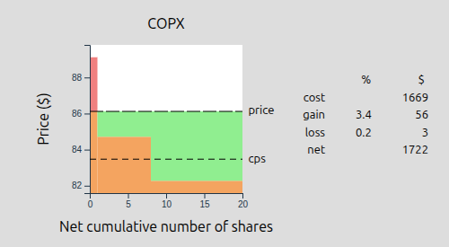

# Holdings

Visualization of current holdings based on Vanguard downloadable CSV data file, `OfxDownload.csv`.

## Stack

- frontend
    1. Vue 3 - Single Page App
    1. D3 - plotting
    1. Vite - building
    1. TypeScript
- backend
    1. json-server mocked server
    1. Python data processing using Pandas to wrangle CSV to JSON

## Installing

We're going to need 3 terminals, one for hosting the frontend, one for hosting the data, and a
third one for processing the data.

### Frontend (dev setup)

Open a new terminal and change directory into `frontend/`.

```console
$ cd frontend
```

Install the dependencies

```console
$ npm install
```

Start hosting the frontend

```console
$ npm run dev
```

Note that there is nothing to see yet at `http://localhost:5173` or whatever other port you told
Vite to start hosting the frontend. Additionally the browser console should show an error about not
being able to find `http://localhost:3000/holdings`.

Further note that this setup is not secure, but that's OK as long as you're just running this app
locally on your own machine.

### Backend

Open a new terminal, change directory into `backend/`.

```console
$ cd backend
```

Install the dependencies for running `json-server`:

```console
$ npm install
```

Create an empty file that will hold the data as JSON:

```console
$ touch data/db.json
```

Start the JSON file server and let it watch for changes to file `data/db.json`. 

```console
$ ./node_modules/.bin/json-server data/db.json --port 3000  # or another port of your choosing
```

### Processing

Open a new terminal, change directory into `backend/` if necessary.

```console
$ cd backend
```

Create a Python virtual environment
```console
$ python3 -m venv venv
```

Activate the Python virtual environment
```console
$ source venv/bin/activate
```

Install dependencies and create command aliases `process-holdings` and `get-prices`, both of which
we will use in a moment

```console
$ pip install .
```

#### `process-holdings`

Download the cost basis spreadsheet `costbasisdownload_3162.csv` from Vanguard and save it for
example as `data/costbasisdownload_3162.csv`. Then, start processing the data from the CSV file and
let the script pipe its results to a new file, `data/db.json`.

```console
$ process-holdings ./data/costbasisdownload_3162.csv > ./data/db.json
```

For reference, `process-holdings` has a help text as well:

```console
$ process-holdings --help
Usage: process-holdings FILENAME

   FILENAME   Name of the file that contains the Vanguard
              transactions for each of your holdings
```

#### `get-prices`

In order to show the previous day's closing prices in each graph, you can retrieve pricing data
from `api.massive.com`. This requires that you have an API key, which you can get by registering for
a free account on `massive.com`. Once you have the key, go back to the first terminal, create an
environment variable `API_KEY_MASSIVE` whose value is the key, like so:

```console
export API_KEY_MASSIVE=<your api key>
```

Then run

```console
$ get-prices http://localhost:3000
```

assuming that port 3000 is where `json-server` is hosting the data.

For reference, `get-prices` also has a `--help`:

```console
$ get-prices --help
Usage: get-prices <URL>

   <URL>     URL for the holdings database server
```

It should output some text, and update the `data/db.json` file with the pricing information for the
previous trading day.

Now open your browser to `http://localhost:5173` or wherever you told Vite you want to host the
frontend. It should show images like this for each of the holdings from you transactions file:


